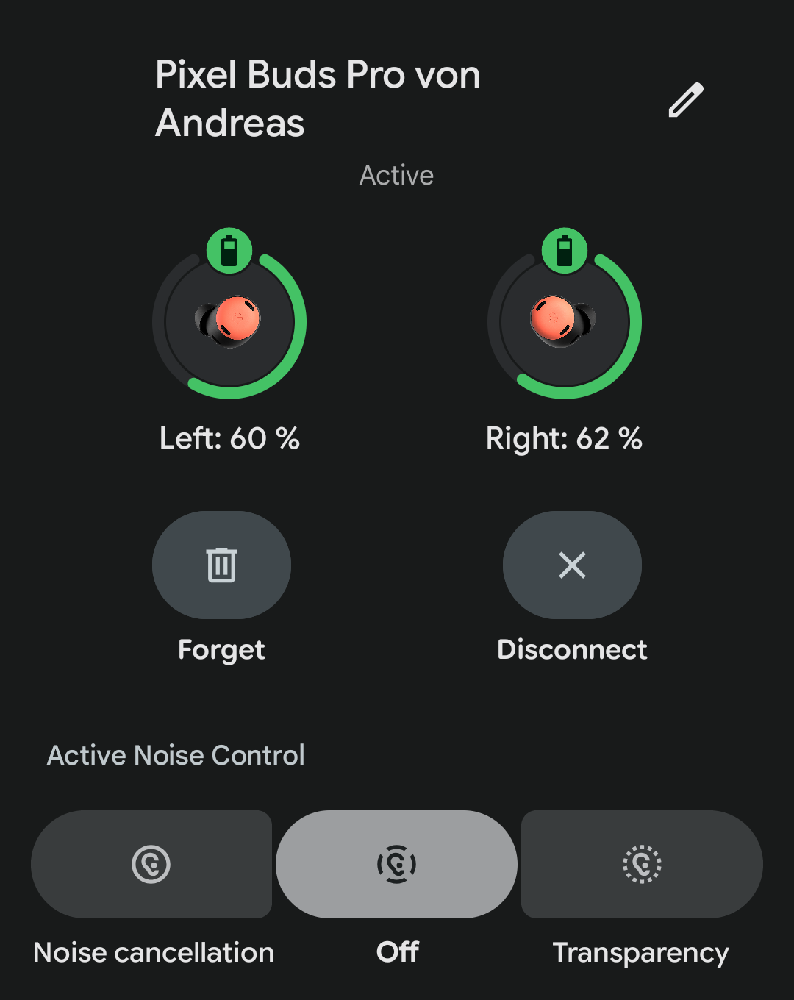

# Headsets

---
layout: section
transition: fade-out
---

<animated-text
    text="The Dream"
    font="parisienne"
    :speed="4"
    :delay="0.5"
    :effects="{ globalGradient: { colors: ['#f0f','#44f','#0ff', '#0f0', '#ff0', '#f00']  } }"
    class="text-[100px]"
  />

---
layout: image
image: /the-fantasy.png
transition: slide-left
---

<!--
arcane gestures to manipulate the virtual space around us
but what we got instead...
-->

---
layout: section
transition: slide-up
---

## What is actually available <green>today</green>? {.inline.view-transition-title}

---
layout: section
transition: slide-left
---

## What is <purple>AR</purple>, <green>VR</green> and <blue>MR</blue>?

<!--
Who owns a VR device
-->

---
transition: view-transition
class: text-center
---

---
transition: slide-down
---

<purple text-3xl abs-bl ml-118>
  AR</purple>

<green text-3xl abs-bl ml-89>
  VR</green>

<blue text-3xl abs-bl ml-147>
  MR</blue>

---
layout: section
transition: slide-left
---

## What is actually available <green>today</green>?

---
layout: iframe
url: https://vr-compare.com/compare?h1=0iz9ksGZA&h2=LUx-f7dXc&h3=_IiTfLZMZ
scale: 0.8
---

<!--
fov, human about 200-220

ppd vs ppi, regular screen can have 70ppd
-->

---
layout: iframe
url: https://vr-compare.com/compare?h1=w8xCM-oPA&h2=Odlfnpa2w&h3=0q3goALzg&h4=HYDBLMvbu&h5=qmdzGfchi
scale: 0.8
---

<!--
Meta Quest 3 is a solid and cheap option
-->
